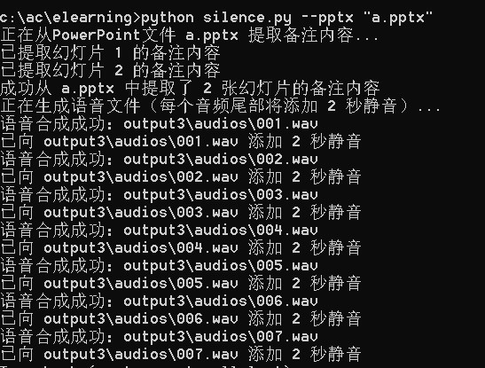

# PowerPoint_notes2Speech / 将 PowerPoint 幻灯片备注转换为语音音频文件

**English**: A straightforward utility that converts PowerPoint slide notes into speech audio files. It specifically extracts presenter notes from your PowerPoint presentations and uses Aliyun Text-to-Speech API to create clear, natural-sounding narrations with customizable silence at the end of each audio clip.

**中文**: 一个简洁实用的工具，专门将 PowerPoint 幻灯片备注转换为语音音频文件。它精确提取演示文稿中的讲者备注，然后使用阿里云文字转语音 API 创建清晰自然的旁白，并在每个音频剪辑结尾添加可自定义的静音时长。



## Features / 功能特点

- Exclusively extract speaker notes from PowerPoint slides
- Generate natural speech audio with Aliyun TTS
- Add customizable silence duration at the end of each audio
- Simple command-line interface
- Focus on presentation notes, ignoring slide content

## Installation / 安装

```bash
# Clone the repository
git clone https://github.com/yourusername/PowerPoint_notes2Speech.git
cd PowerPoint_notes2Speech

# Install dependencies
pip install python-pptx requests argparse
```

## Usage / 使用方法

```bash
python ppt_to_speech.py --pptx your_presentation.pptx --silence 2
```

### Parameters / 参数

- `--pptx`: Path to your PowerPoint file / PowerPoint 文件路径
- `--output`: Output directory (default: 'output') / 输出目录（默认：'output'）
- `--silence`: Duration of silence at the end of each audio in seconds (default: 2) / 每个音频结尾的静音时长（秒，默认：2）

## Requirements / 依赖

- Python 3.6+
- python-pptx
- requests
- argparse
- wave

## License / 许可

MIT